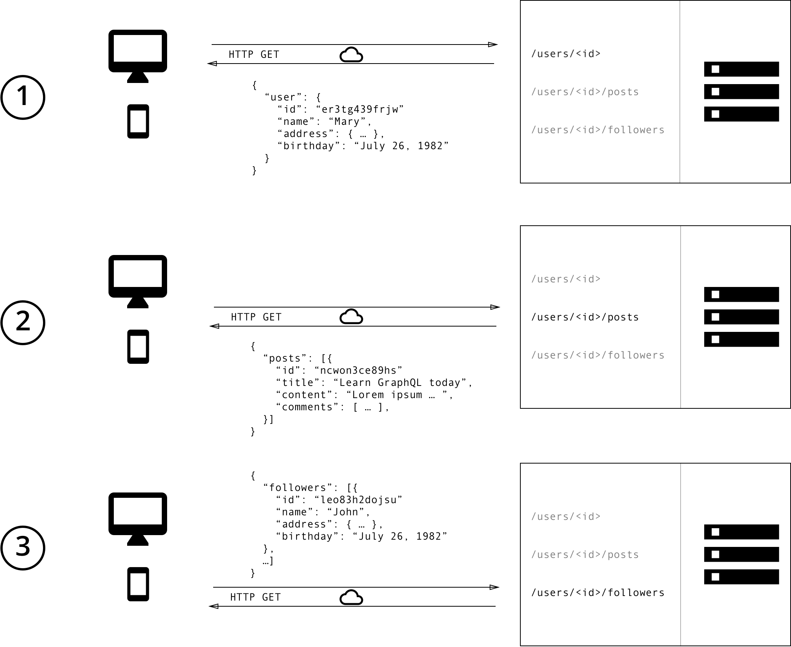

# Sprint 1

> March 30 April 12


# Working Paper 

In this sprint we work with the epic *login*, in which the following doubts were presented, as this was the first sprint, doubts were also raised about validators and the handling of errors for the course of the project

## Questions and asumptions
* GraphQL or Rest API?
* What is the best way to encrypt a password?
* What form of authentication should we use?
* How do we sanitize and validate the values that enter the server?
* How can we send error codes to the client and give them a better error message?


## Why GraphQL and not Rest API
We believe that one of the great limitations of the REST API is in the **maintainability**, although there are solutions such as the creation of more **end points, use of query parameters or the simple filtering of fields**, these in the end do not They help to improve the productivity of the frontend and backend teams and can even increase the bandwidth if we want to filter unnecessary fields.



This is why we consider the use of `GraphQL`, since only **one endpoint** is handled and it encourages us to perform schema analysis first before starting to code, which helps a lot with project documentation and maintainability. and to its scalability, in general we can say that GraphQL:

* It's a normal Node (+ Express JS) Server
* ONE **Single Endpoint** (typically */graphql*)
* Uses **POST** request because Request Body uses Data Strcture of Retrieved Data
* Server-side resolver analices Request Body, fetches and prepares and returns data.
> Unlike REST API, GraphQL uses POST request, if we remember a GET request it is a method that sends the information by appending them on the page request and POST is a method that transfers the information via HTTP header.


In this project we will use `Apollo-Server` as it uses GraphQl and makes the development process much easier.
## Best way  to encrypt a password
##### 🔒 BCrypt

According to [Hale (2010, January 31)](https://codahale.com/how-to-safely-store-a-password/) The best way to create and save a password is by using `BCrypt`, in the document It is mentioned that it is more secure, although it may take a little longer than other general purpose hash functions (MD5, SHA1, SHA2, SHA3).

So, for the project we will use the `bcryptjs` package, as we will only use a single user then we must first create a new document with the admin information
```js
// .......
// User model
const User = require('./src/models/user');

const mongoose = require('mongoose');
// .......
let options = {
    useNewUrlParser:true, 
    useUnifiedTopology:true, 
    useCreateIndex: true
}
```
```js
mongoose.connect(process.env.MONGODB_URI,options).then( result => {
    // Creating a user object 'u'
    let u = {  
        email:'lcabienesraicestkt@gmail.com',
        password: 'LCABienesRaices'
    };
    // Encrypting password.
    bcrypt.hash('SOME_SECRET_PASSWORD',12).then( encryptedPassword => {
        // For security propurses we'll don't expose the real email and password.
        // Creating a user from the model schema.
        const user = new User({
             email:'someEmail@domain.com', 
             password: encryptedPassword 
        });

        // Saving adming info on the data base
        return user.save();
    }).then(response => {
        console.log(response)
    }).catch(err => {
        console.log(err)
    })
```
After doing this we receive the following response.

```js
{
  _id: 6270f76cbb4ebe4894dd7721,
  email: 'someEmail@domain.com',
  password: '$1a$12$jtaUHSX3WlD557n6nUckTu15zMI8t2rXRR6IYgAZfBasRf6BLZtq.',
  __v: 0
}
```

With this we have managed to enter the user's information to the database, the next step is to create a JWT when a Log In is made.

## Auth Technique used

##### JWT JSON Web Token
Another of the doubts we had was to perform authentication and authorization, in this project we took the path of JWT (JSON Web Tokens). For the implementation we use `express-jwt` which is a middleware that will check if there is a token in all the requests made on the page, then with the` jwt` package we will create and verify JWT tokens.

To continue let's remember the difference between authenticating and authorizing
* **Authentication** is determining whether a given user is logged in, and subsequently determining which user someone is. There are several ways to authenticate credentials, in this case we will use `JSW`
* **Authorization** is then determining what a given user has permission to do or see.

In this project, as there is only one admin, then we will authorize to perform an action if the user is authenticated, but it will not be necessary to implement (for now) a complex authorization.

## How to validate and sanitize the entries to the server?
Sanitizing and validating the information we obtain on the server is very important if we want to improve the quality and safety of our product. For this project it was decided to use the `validator ^ 13.5.2` package. This package validates any String, it will be used for user input and to **avoid Cross side scripting.**

## What is the best way to handle errors?
It is important to let our client (React) know the errors that happen when a request is sent (message and error code), for this we use the methods that `Apollo Server` gives us, the best practices were applied according to what it says on [this blog](https://www.apollographql.com/blog/full-stack-error-handling-with-graphql-apollo-5c12da407210/)

# Considerations
* Logout When the login is made, a JWT token will be stored in the LocalStorage of the client, when he wants to logout then the token should be destroyed.

* RememberMe For remember me we use an expiration time, if the user chooses the rememberMe option then his token will be stored for 2 months, otherwise it will be stored for 3 hours
* When `expiresIn` ends, the user is denied access, so we must create a way to make a new Token without the user having to login again, for this we could do what it says in the [blog](https://www.apollographql.com/blog/full-stack-error-handling-with-graphql-apollo-5c12da407210/)

> Both solutions are not the most optimal, but they will be solved in future versions.


# Resources
Hale, C. H. (2010, January 31). How To Safely Store A Password. Codahale.Com. https://codahale.com/how-to-safely-store-a-password/
